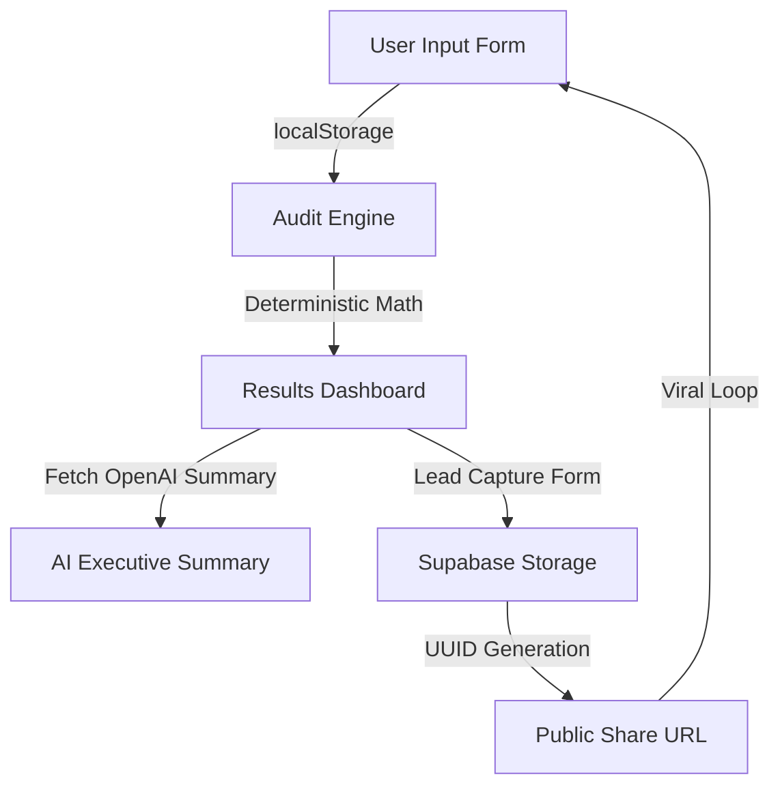

# SpendLens Architecture

This document outlines the high-level architecture, technology decisions, and scaling strategy for the SpendLens platform.

## Application Flow

## Technology Decisions

* **Why React?**
  We chose React (via Vite) for its unmatched ecosystem and component reusability. Given the highly interactive nature of the multi-step form and immediate feedback required on the results dashboard, React's declarative state management provides the smoothest developer and user experience.

* **Why Supabase?**
  We needed a fast, reliable, and secure backend to handle lead captures and store audit snapshots for the public share URLs. Supabase provides an instant Postgres database with an out-of-the-box API and row-level security, allowing us to ship the MVP in days instead of weeks without managing infrastructure.

* **Why localStorage?**
  To maximize conversion rates and reduce user friction, the initial audit requires zero authentication. `localStorage` is used to persist the user's stack data across sessions so they never lose their progress before choosing to generate a public report.

* **Why TypeScript?**
  Financial auditing requires absolute precision. TypeScript ensures that all data structures (tool objects, price tiers, seats) maintain strict type safety, eliminating a massive class of runtime errors (`NaN` calculations, undefined properties) that would otherwise compromise the integrity of the audit engine.

## Scale Strategy: 10,000 Audits / Day

As the application scales to handle significantly higher traffic, the architecture will evolve to maintain performance and reliability:

1. **Move Audit Engine Server-Side:** Currently, calculations happen on the client. To prevent tampering and centralize pricing logic updates, the core audit engine will be migrated to edge functions or a dedicated backend service.
2. **Implement Redis Caching:** Frequently accessed public share URLs and static pricing configurations will be cached in Redis to alleviate database load on Supabase and reduce read latency.
3. **Queue AI Summaries:** Generating real-time OpenAI summaries blocks the UI loop and risks rate-limiting. At scale, AI summary generation will be decoupled using a message queue and delivered asynchronously.
