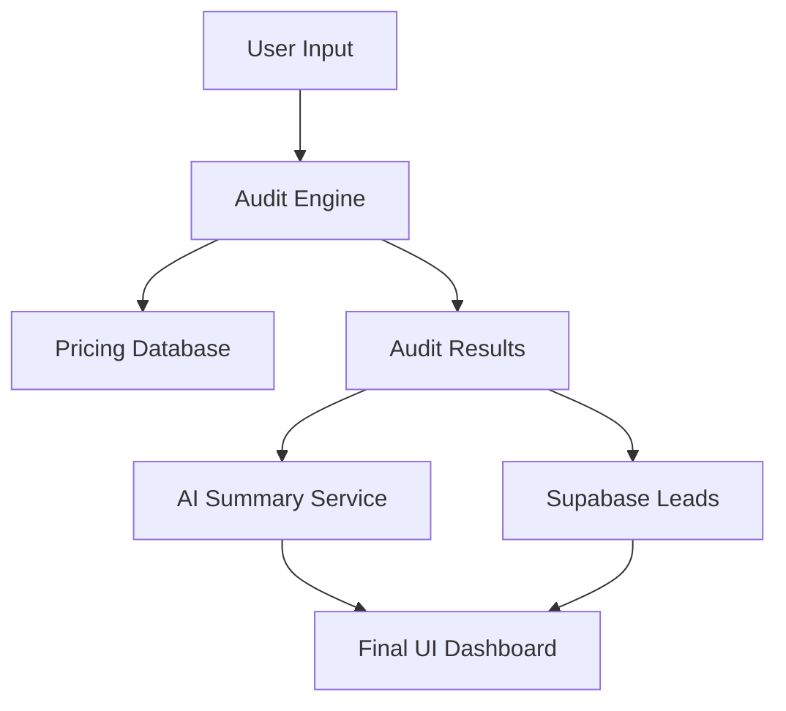

# SpendLens Architecture

SpendLens is a high-fidelity AI audit engine designed to help startups identify and eliminate recurring waste in their AI tool stack.

## System Overview

## Core Components

### 1. Audit Engine (`src/utils/auditEngine.ts`)
The intelligence layer of the application. It applies rule-based logic to compare current user spend against optimized configurations. Key rules include:
- **Tier Minimization**: Downsizing Enterprise/Team plans when seat counts don't justify the premium.
- **Overlap Detection**: Flagging duplicate subscriptions (e.g., ChatGPT and Claude being used for the same team).
- **API Optimization**: Recommending credit-based procurement for high-volume API users.

### 2. Pricing Database (`src/data/pricingData.ts`)
A centralized source of truth for all supported AI tools, including tier-specific pricing and "Recommended For" heuristics used by the engine.

### 3. AI Summary Service (`src/services/aiSummary.ts`)
Uses LLMs to generate a 100-word executive summary of the audit. Features a robust fallback mechanism to ensure the UI never breaks if the AI service is unavailable.

### 4. Backend Integration (`src/services/supabase.ts`)
Captures leads and stores audit snapshots for viral sharing and follow-up.

## Technical Stack
- **Frontend**: React 19, Vite, Tailwind CSS 4.
- **Routing**: React Router 7.
- **Backend**: Supabase (PostgreSQL).
- **SEO**: React Helmet for dynamic Open Graph tags.
